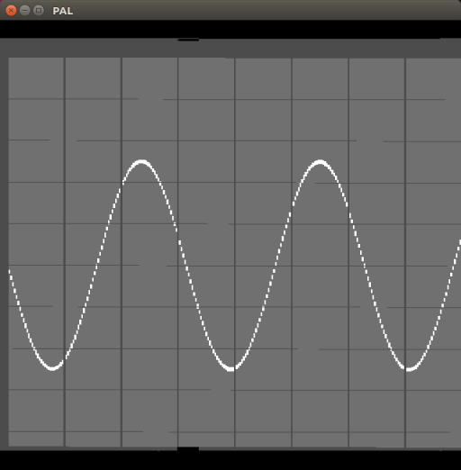

# composite-video-monitor

Emulation of a PAL/NTSC composite signal compatible monitor.

Displays 5Mhz composite sampled signal aquired from localhost:10000.

Some rudimentary controls on keyboard
- Focus on 'F'/'f'
- Brightness on key 'B'/'b'
- Zoom on key 'Z'/'z'
- Pan on keys X/x and 'Y'/'y'
- Time zoom on key 'T'/'t'
- toggle time stop on key 's'
- time advance one dot on key 'space'
- toggle cursor  on key 'c'

# Samples
This screenshot was taken using the signal generated by project 
https://github.com/martinsteennielsen/composite-video-oscilloscope

No signal connected
 
